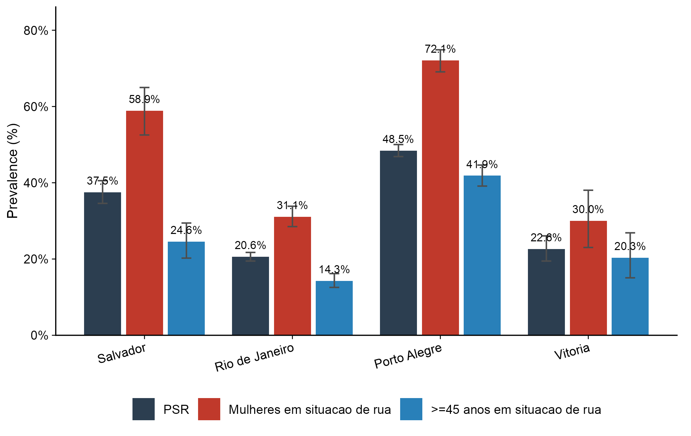
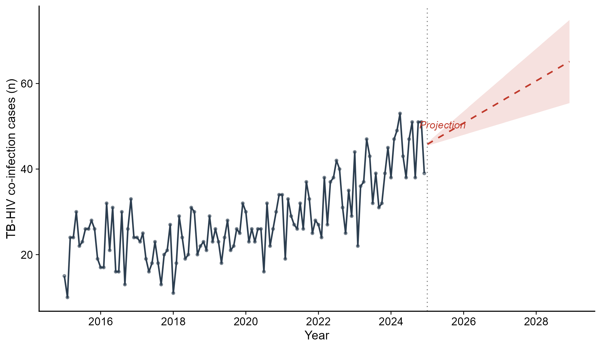
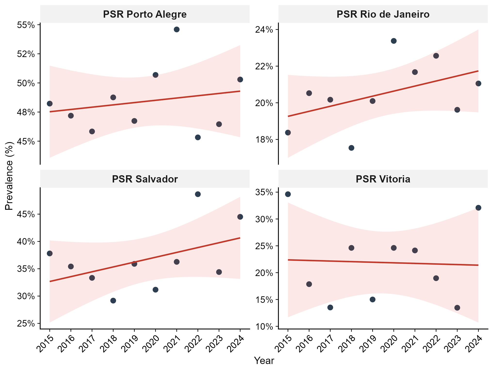
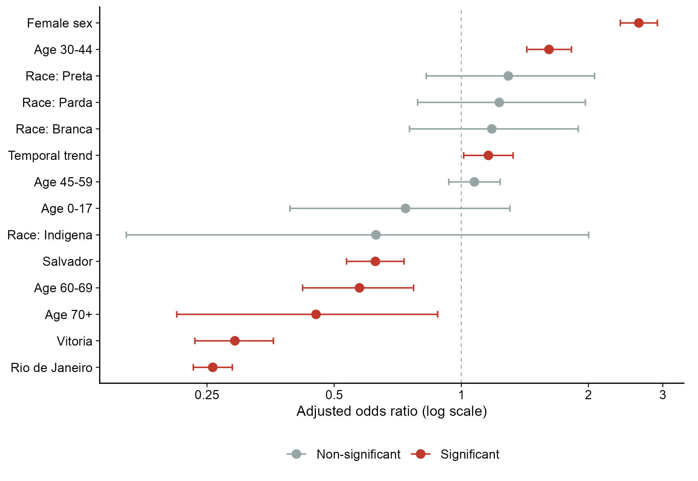
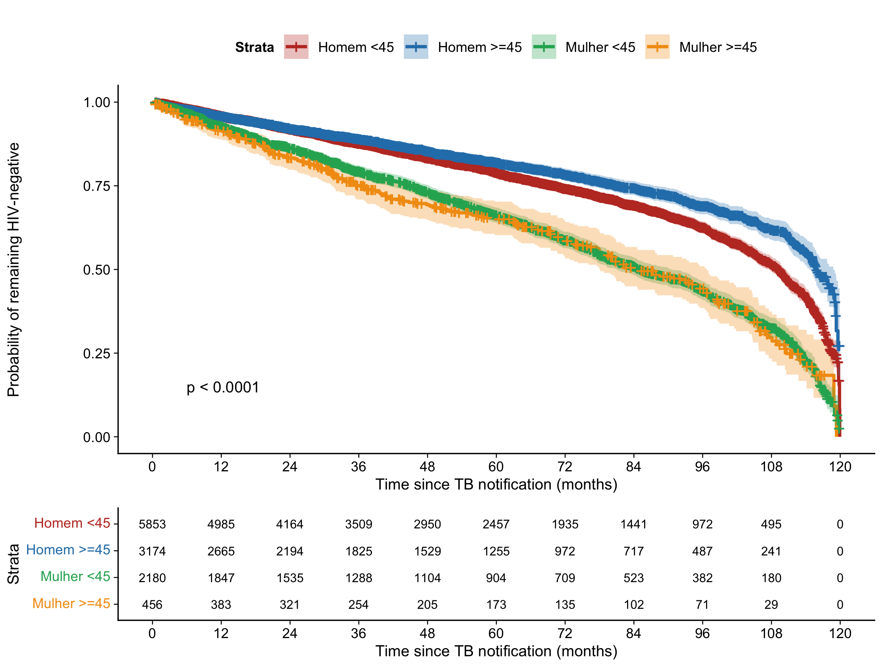
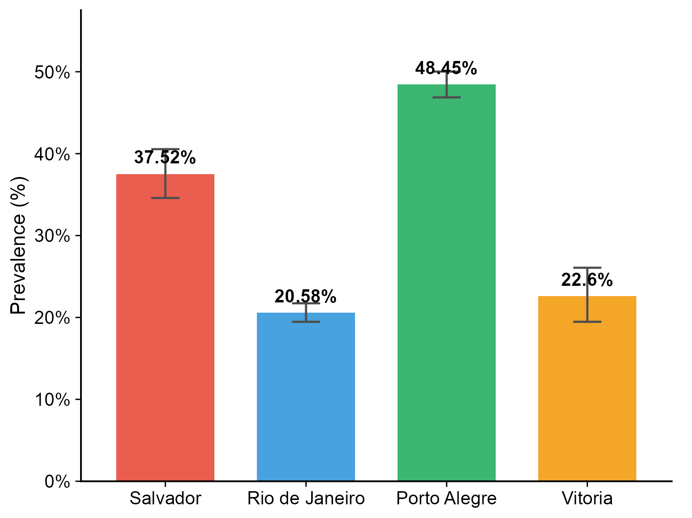
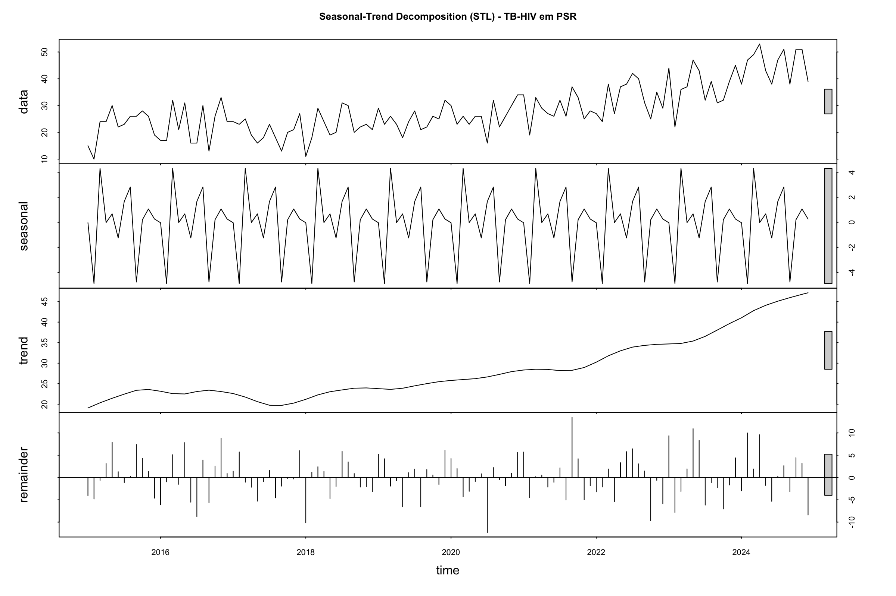

# TB-HIV Co-infection Among Homeless Persons in Four Brazilian Capitals, 2015-2024

> **A population-based study with temporal trends, forecasting, and associated factors**

**Authors:** Audencio Victor, Osiyalle Akanni Silva Rodrigues

**Manuscript format:** The Lancet

---

## Summary

This study uses 10 years of individual-level data from the Brazilian Notifiable Diseases Information System (SINAN-TB) to estimate the prevalence, temporal trends, and factors associated with TB-HIV co-infection among **homeless persons** in Salvador, Rio de Janeiro, Porto Alegre, and Vitoria (2015-2024).

### Key Findings

| Indicator | Value |
|---|---|
| Total TB notifications analysed | 262,701 |
| Homeless persons with TB | 11,663 (4.4%) |
| **TB-HIV prevalence in homeless persons** | **32.7%** (95% CI 31.8-33.6) |
| TB-HIV in general TB population | 14.2% |
| TB-HIV in **homeless women** | **49.1%** (47.1-51.1) |
| Highest city: **Porto Alegre** | **48.5%** |
| Strongest predictor: **female sex** | aOR 2.63 (2.38-2.91) |
| Drug use | aOR 1.49 (1.34-1.66) |
| Cure rate (HIV+ homeless) | 22.2% |
| Treatment abandonment | >42% |
| ART coverage in Porto Alegre | Only 36.8% |

---

## Figures

### Figure 1 - Prevalence by city and population group


### Figure 2 - Time series and ensemble forecast (2015-2028)


### Figure 3 - Joinpoint regression by city


### Figure 4 - Forest plot of adjusted odds ratios


### Figure 5 - Kaplan-Meier survival curves


### Figure 6 - Prevalence by city (homeless persons)


### STL Decomposition


---

## Data Source

- **System:** SINAN-TB (Sistema de Informacao de Agravos de Notificacao - Tuberculose)
- **Repository:** DATASUS / Brazilian Ministry of Health
- **Access:** `ftp://ftp.datasus.gov.br/dissemin/publicos/SINAN/DADOS/`
- **Period:** 2015-2024 (definitive + preliminary files)
- **States:** Bahia (Salvador), Rio de Janeiro, Rio Grande do Sul (Porto Alegre), Espirito Santo (Vitoria)
- **Key variables:** `POP_RUA` (homeless status), `HIV` (HIV result), `AGRAVDROGA` (drug use), `AGRAVTABAC` (smoking), `SITUA_ENCE` (treatment outcome), `ANT_RETRO` (antiretroviral therapy)

> **Note:** The SINAN Syphilis (SIFA) notification form does **not** include a homelessness indicator (`POP_RUA`). Therefore, syphilis-HIV co-infection analysis among homeless persons was not feasible.

---

## Statistical Methods

| Method | Purpose | R Package |
|---|---|---|
| Wilson 95% CI | Prevalence estimation | `stats::prop.test` |
| ARIMA (auto.arima) | Time series modelling | `forecast` |
| ETS | Exponential smoothing | `forecast` |
| Prophet | Forecasting with seasonality | `prophet` |
| Ensemble (ARIMA+ETS) | Combined forecast | custom |
| ADF and KPSS tests | Stationarity testing | `tseries` |
| STL decomposition | Seasonal-trend decomposition | `stats` |
| Joinpoint regression | Temporal trend (APC) | `segmented` |
| Logistic regression | Adjusted odds ratios | `stats::glm` |
| Negative binomial | Incidence rate ratios | `MASS::glm.nb` |
| GLMM | Random effects by city | `lme4::glmer` |
| Cox proportional hazards | Hazard ratios | `survival::coxph` |
| Kaplan-Meier | Survival curves | `survival::survfit` |

---

## Repository Structure

```
TB-HIV-Homeless-Brazil/
|
|-- analise_COMPLETA.R           # Main script: downloads data, runs all analyses, generates figures
|-- gerar_paper_lancet.R         # Generates Word manuscript in Lancet format
|-- MASTER_coinfeccoes.R         # Legacy master script (modular version)
|-- README.md
|-- .gitignore
|
|-- outputs/
    |-- Paper_TB_HIV_PSR_Lancet.docx   # Complete manuscript (Word)
    |
    |-- figuras/
    |   |-- fig1_prevalencia_tb_hiv.png    # Prevalence by group and city
    |   |-- fig2_serie_forecast.png        # Time series + forecast
    |   |-- fig3_joinpoint.png             # Joinpoint trends by city
    |   |-- fig4_forest_plot.png           # Forest plot (OR)
    |   |-- fig5_kaplan_meier.png          # Kaplan-Meier curves
    |   |-- fig6_prevalencia_capitais.png  # Prevalence by city
    |   |-- fig_stl.png                    # STL decomposition
    |
    |-- tabelas/
        |-- tab1_prevalencia_geral.csv     # Prevalence by group/city
        |-- tab1_descritiva_psr_tb.csv     # Sociodemographic profile
        |-- tab_apc_joinpoint.csv          # Annual percent change
        |-- tab_arima_diagnostico.csv      # ARIMA model diagnostics
        |-- tab_or_logistico.csv           # Adjusted odds ratios
        |-- tab_or_com_substancias.csv     # OR with substance use covariates
        |-- tab_cox_hr.csv                 # Cox hazard ratios
        |-- tab_nb_irr.csv                 # Negative binomial IRR
        |-- tab_efeitos_mistos.csv         # GLMM fixed effects
        |-- tab_ensemble_forecast.csv      # Forecast projections
        |-- tab_testes_estacionaridade.csv # ADF/KPSS tests
        |-- tab_comparacao_psr_naopsr.csv  # Homeless vs non-homeless comparison
        |-- tab_desfechos_hiv_psr.csv      # Treatment outcomes by HIV status
        |-- tab_arv_psr_hiv.csv            # Antiretroviral coverage
```

---

## How to Reproduce

### Requirements
- R >= 4.5
- Internet connection (to download from DATASUS FTP)
- ~10 minutes for data download, ~7 minutes total runtime

### Steps

```r
# 1. Run the complete analysis (downloads data + all models + figures)
source("analise_COMPLETA.R")

# 2. Generate the Lancet-format Word manuscript
source("gerar_paper_lancet.R")
```

### R Packages (installed automatically)
`read.dbc`, `dplyr`, `tidyr`, `readr`, `stringr`, `lubridate`, `forcats`, `janitor`, `forecast`, `tseries`, `zoo`, `MASS`, `lme4`, `survival`, `survminer`, `segmented`, `ggplot2`, `scales`, `patchwork`, `viridis`, `gtsummary`, `broom`, `broom.mixed`, `purrr`, `glue`, `prophet`, `officer`, `flextable`

---

## Definitions

| Term | Definition |
|---|---|
| PSR | Pessoa em Situacao de Rua (homeless person) |
| TB-HIV | Tuberculosis and HIV co-infection |
| POP_RUA | SINAN-TB variable identifying homeless persons (1=yes) |
| Elderly | Age >= 45 years (accelerated ageing in homeless populations) |
| APC | Annual Percent Change (from joinpoint regression) |
| aOR | Adjusted Odds Ratio |
| HR | Hazard Ratio |
| IRR | Incidence Rate Ratio |
| ART | Antiretroviral Therapy |

---

## Citation

Victor A, Rodrigues OAS. TB-HIV co-infection among homeless persons in four Brazilian capitals, 2015-2024: a population-based study with temporal trends and forecasting. *Manuscript in preparation*. 2026.

---

## License

This project uses publicly available, de-identified data from the Brazilian Ministry of Health (DATASUS). No ethics approval required per Brazilian National Health Council Resolution 510/2016.
